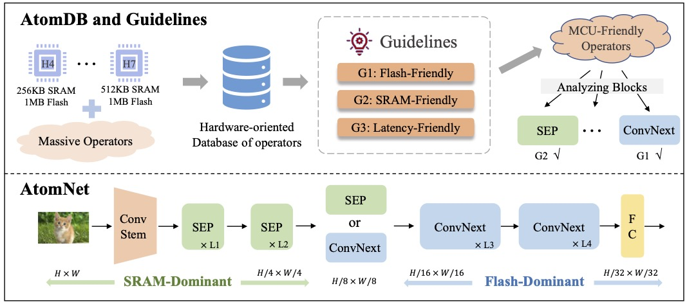
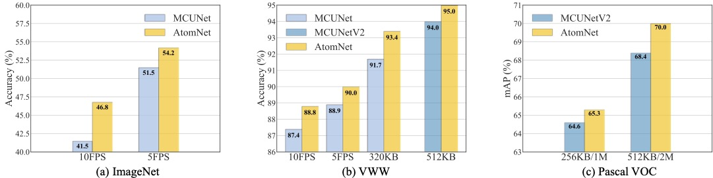
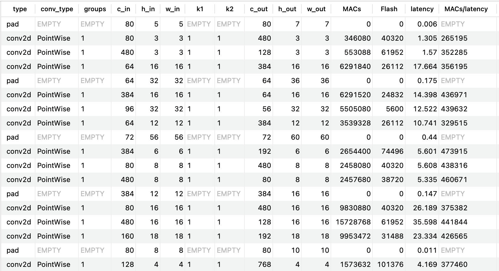
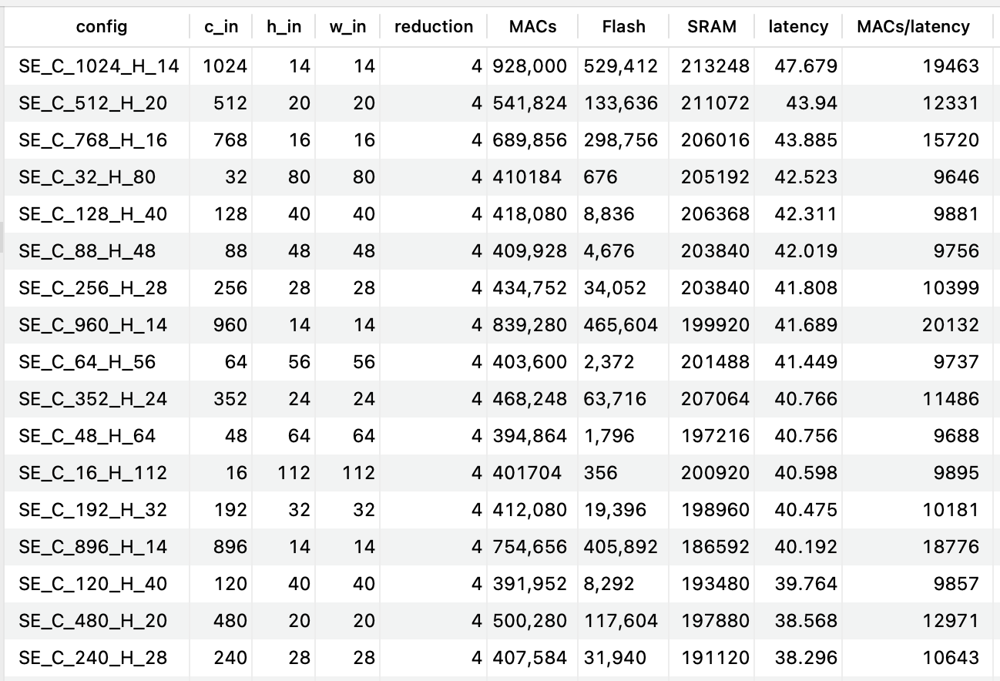

# AtomNet: Designing Tiny Models from Operators under Extreme MCU Constraints

## Overview

With the operator's knowledge in **AtomDB**, **AtomNet** can better handle MCU's hardware resources bottleneck. Our framework is a **hardware-oriented** method.

AtomNet also achieves higher accuracy and latency reduction. We achieve **3.5%** accuracy enhancement and more than **20%** latency reduction on 320KB MCU compared to the current state-of-the-art method.

## AtomDB

We boil down the problem from net to operator for practical mining guidelines from MCU hardware. Then we construct a database, AtomDB, which contains the necessary information to describe a single atom operation.

Since there is not only one atomic operation in the SE module and the convolution operation, for example, if there is a pad in the convolution operation, it is necessary to perform the pad first and then perform the convolution operation. To analyze the SRAM of the operator during execution, we also construct an database containing information such as the SRAM for SE.

### Build AtomDB

- We provided an offline version of the AtomDB test on STM32H743@400MHz (512KB SRAM 2MB Flash) in [`AtomDB/atomdb.csv`](AtomDB/atomdb.csv) and [`AtomDB/atomdb_se.csv`](AtomDB/atomdb_se.csv).
- It is easy to build AtomDB on any STM32 MCU by following the instructions in [`AtomDB/README.md`](AtomDB/README.md).

## AtomNet

### Model Zoo

- Note that the **TE F7** are reported in **MCUNet** with **TinyEngine** on STM32F746ZG.
- Note that ours **STM F7** and **STM H7** are tested with **X-CUBE-AI 7.2.0** on STM32F746 and STM32H743, respectively.

#### **ImageNet**

| Model / Library             | MACs | SRAM  | Flash  | Top-1       | TE F7 | STM F7     | STM H7 |
|-----------------------------|------|-------|--------|-------------|-------|------------|--------|
| MCUNet-256KB                | 68M  | 238KB | 1007KB | 60.3%       | 681ms | 803ms      | 368ms  |
| **Ours-256KB**              | 80M  | 232KB | 981KB  | **64.0**%   | -     | **626ms**  | 275ms  |
| MCUNetV2-M4                 | 119M | 196KB | 1010KB | 64.9%       | -     | -          | -      |
| **Ours-256KB-Max**          | 110M | 252KB | 1019KB | **66.7**%   | -     | 1030ms     | 405ms  |
| MCUNet-320KB                | 82M  | 293KB | 897KB  | 61.8%       | 819ms | 980ms      | 433ms  |
| **Ours-320KB**              | 111M | 291KB | 1010KB | **65.3**%   | -     | **781ms**  | 352ms  |
| MCUNet                      | 126M | 452KB | 2014KB | 68.5%       | -     | OOM        | 521ms  |
| **Ours-512KB**              | 163M | 370KB | 2017KB | **70.8**%   | -     | OOM        | 490ms  |
| MCUNetV2-H7                 | 256M | 465KB | 2032KB | 71.8%       | -     | -          | -      |
| **Ours-512KB-Large**        | 233M | 469KB | 2027KB | **72.2**%   | -     | OOM        | 836ms  |
| **Ours-512KB-Max**          | 362M | 469KB | 1925KB | **73.0**%   | -     | OOM        | 1188ms |

#### **VWW**

| Model / Library | SRAM  | Flash  | Top-1     |
|-----------------|-------|--------|-----------|
| MCUNet-10FPS    | 56KB  | 463KB  | 87.4%     |
| **Ours-10FPS**  | 81KB  | 545KB  | **88.8**% |
| MCUNet-5FPS     | 88KB  | 534KB  | 88.9%     |
| **Ours-5FPS**   | 108KB | 656KB  | **90.0**% |
| MCUNet-320KB    | 259KB | 673KB  | 91.7%     |
| **Ours-320KB**  | 291KB | 853KB  | **93.4**% |

For training configs and pretrained models, please check [AtomNet/configs](AtomNet/configs).
